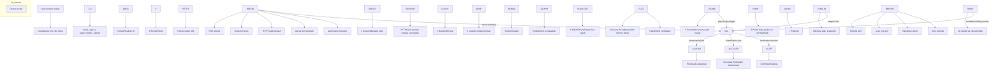

```mermaid
flowchart TB
  U"["User domain kiritadi"] --> CLI"["heartbeat.py CLI yoki menu"]
  CLI --> ARGS"["make_args va apply_runtime_options"]
  ARGS --> P"["PentestPipeline run"]

  P --> RECON"["1 ReconEngine"]
  RECON --> DNS"["DNS resolve"]
  RECON --> NMAP"["nmap port scan"]
  RECON --> HTTPT"["HTTP target tanlash"]
  RECON --> WAF"["waf va tech aniqlash"]
  RECON --> SUB"["subdomain discovery"]

  HTTPT --> TARGET"["Primary target URL"]
  TARGET --> SESSION"["2 SessionManager login"]
  SESSION --> CLIENT"["HTTPClient session cookies va headers"]

  CLIENT --> BASE"["3 BaselineEngine"]
  BASE --> CRAWL"["4 Crawler endpoint topadi"]
  CRAWL --> PARAM"["5 ParamDiscoverer param topadi"]
  PARAM --> GRAPH"["EndpointGraph"]

  GRAPH --> PLAN_IN"["Endpoint list va metadata"]
  PLAN_IN --> AI_PLAN"["AIEngine plan_endpoints"]
  AI_PLAN --> PLAN_OUT"["Prioritized endpointlar"]

  PLAN_OUT --> FUZZ"["6 OWASPFuzzEngine fuzz qiladi"]
  FUZZ --> TOOLS"["Kali tools ffuf sqlmap dalfox commix wfuzz"]
  FUZZ --> RAWF"["Raw finding candidates"]

  RAWF --> AI_CLASS"["AI classify va risk baholash"]
  AI_CLASS --> CORR"["Correlator findinglarni birlashtiradi"]
  CORR --> AI_FP"["FPFilter false positive ni olib tashlaydi"]
  AI_FP --> CLEAN"["Confirmed findings"]

  CLEAN --> REPORT"["7 Reporter"]
  REPORT --> OUT1"["findings json"]
  REPORT --> OUT2"["scan_log json"]
  REPORT --> OUT3"["markdown report"]
  REPORT --> OUT4"["docx optional"]

  subgraph AI_Service
    OLL"["Ollama model"]
  end

  RECON -->|recon summary| OLL
  CRAWL -->|page body snippet| OLL
  PLAN_IN -->|endpoint list| OLL
  RAWF -->|candidate finding context| OLL

  OLL -->|prioritization json| AI_PLAN
  OLL -->|classification json| AI_CLASS
  OLL -->|verification decision| AI_FP
```
